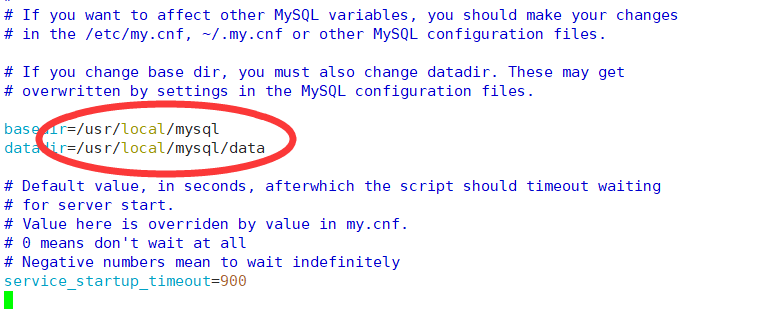
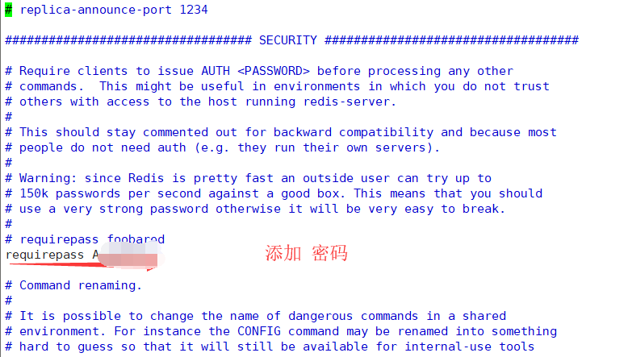
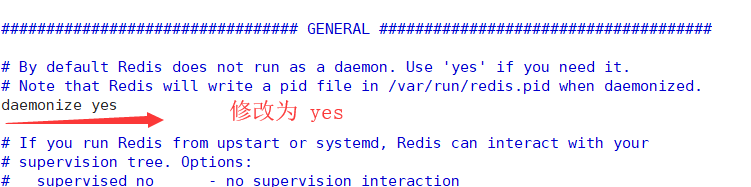
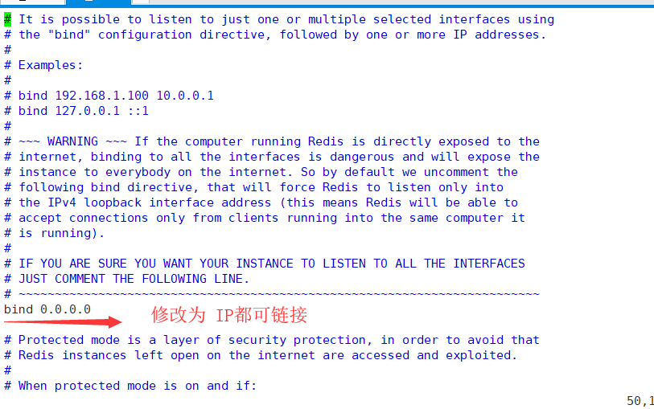

**前提：小白学习阿里云服务器，记录笔记。我的云服务器 操作系统是   CentOS  7.6 64位。**

# 1、云服务器ECS 安装开发环境
  + ### 1-1）下载安装包，并将安装包放在云服务器上

    + 1、下载开发需要的基本环境：JDK8、Tomcat8、Mysql5。

        这里提供百度云下载：<br>
        链接：https://pan.baidu.com/s/1QhWxYOPp4CF0Vu7y_Dld6Q&shfl=sharepset <br>
        提取码：5q8i 

    + 2、将安装包放在云服务器上

        首先，用 xshell登录云服务器，并创建安装包存放目录
        ```
        mkdir /home/temp
        ```
        通过FileZilla或者xftp工具将安装包导入 该目录下。

 + ### 1-2）安装 JDK8

    + 1、进入 /home/temp 目录，将 jdk-8u11-linux-x64.tar.gz 解压并复制到 /usr/local 文件夹下。切换到 /usr/local 文件夹下，创建软连接 java 文件夹，便于以后更改 jdk 版本。

        ```
        [root@andy /]# cd /home/temp
        [root@andy temp]# ls
        apache-tomcat-8.5.43.tar.gz  jdk-8u11-linux-x64.tar.gz
        [root@andy temp]# tar zxf jdk-8u11-linux-x64.tar.gz -C /usr/local
        [root@andy temp]# cd /usr/local/
        [root@andy local]# ln -s jdk1.8.0_11/ java
        ```

    + 2、通过 vim 编辑 /etc/profile，设置 jdk 环境变量

        ```
        [root@andy local]# vim /etc/profile
        ```

        按“向下”箭头定位到文件最后一行，回车。按 "i" 键进行编辑，输入

        ```
        #set java environment
        export JAVA_HOME=/usr/local/java
        export JRE_HOME=$JAVA_HOME/jre
        export CLASSPATH=.:$JAVA_HOME/lib:$JRE_HOME/lib:$CLASSPATH
        export PATH=$JAVA_HOME/bin:$JRE_HOME/bin:$JAVA_HOME:$PATH
        ```

        回车，按 esc 键 退出编辑，回车后输入 ":wq!" 退出 vim。

        输入以下命令，使 profile 配置立即生效

        ```
        [root@andy local]# source /etc/profile
        ```

    + 3、安装完毕。输入命令 java -version，测试是否成功：

        ```
        [root@andy local]# java -version
        java version "1.8.0_11"
        Java(TM) SE Runtime Environment (build 1.8.0_11-b12)
        Java HotSpot(TM) 64-Bit Server VM (build 25.11-b03, mixed mode)
        ```

 + ### 1-3）安装 Tomcat8

    + 1、安装方法同上（安装JDK）。

        进入 /home/temp 目录，将 apache-tomcat-8.5.43.tar.gz 解压并复制到 /usr/local 文件夹下。

        切换到 /usr/local/apache-tomcat-8.5.43/bin 文件夹下，通过 vim 编辑setclasspath.sh，设置 JAVA_HOME。

        ```
        [root@andy local]# cd /home/temp
        [root@andy temp]# tar -zxf apache-tomcat-8.5.43.tar.gz -C /usr/local/
        [root@andy temp]# cd /usr/local
        [root@andy local]# ls
        aegis                 bin  games    java         lib    libexec  share
        apache-tomcat-8.5.43  etc  include  jdk1.8.0_11  lib64  sbin     src
        [root@andy local]# cd apache-tomcat-8.5.43/bin
        [root@andy bin]# vim setclasspath.sh
        ```

        按“向下”箭头定位到文件最后一行，回车。按 "i" 键进行编辑，输入

        ```
        # set jdk path
        export JAVA_HOME=/usr/local/java
        export JRE_HOME=/usr/local/java/jre
        ```

        回车，按 esc 键 退出编辑，回车后输入 ":wq!" 退出 vim。

    + 2、执行 startup.sh，启动 tomcat，查看日志是否成功：
    
        ```
        [root@andy bin]# ./startup.sh 
        Using CATALINA_BASE:   /usr/local/apache-tomcat-8.5.43
        Using CATALINA_HOME:   /usr/local/apache-tomcat-8.5.43
        Using CATALINA_TMPDIR: /usr/local/apache-tomcat-8.5.43/temp
        Using JRE_HOME:        /usr/local/java/jre
        Using CLASSPATH:       /usr/local/apache-tomcat-8.5.43/bin/bootstrap.jar:/usr/local/apache-tomcat-8.5.43/bin/tomcat-juli.jar
        Tomcat started.
        ```

        启动成功，浏览器输入云服务器实例分配的公网IP地址，加8080端口看能否有tom猫出现。例如 http://119.192.205.186:8080/

        

        **注意：此时若访问不通，则可能是服务器实例，没有开通8080端口。看下边，配置云服务器安全组**

 + ### 1-4）配置云服务器安全组

    + 1、登录阿里云服务器ECS，打开控制台，按以下图片操作
        
        
        如需多个端口，可添加多条记录。

 + ### 1-5）安装 Mysql
    + 1、卸载 mariadb
    
      阿里云ECS默认安装了mariadb数据库，安装mysql前先卸载
    
      ```
      [root@andy ~]# rpm -qa|grep mariadb
      mariadb-libs-5.5.60-1.el7_5.x86_64
      [root@andy ~]# rpm -e --nodeps mariadb-libs-5.5.60-1.el7_5.x86_64
      [root@andy ~]# rpm -qa|grep mariadb
      ```
    
    + 2、安装 mysql
    
      1）切换到 /home/temp 目录下，将 mysql-5.7.22-linux-glibc2.12-x86_64.tar.gz 解压并复制到 /usr/local。
    
      ```
      [root@andy ~]# cd /home/temp/
      [root@andy temp]# tar -zxf mysql-5.7.22-linux-glibc2.12-x86_64.tar.gz -C /usr/local
      ```
    
      2）切换到 /usr/local，创建软连接文件夹 mysql。
    
      ```
      [root@andy temp]# cd /usr/local/
      [root@andy local]# ln -s mysql-5.7.22-linux-glibc2.12-x86_64/ mysql
      ```
    
      3）添加系统 mysql组，添加mysql用户。
    
      ```
      [root@andy local]# groupadd mysql
      [root@andy local]# useradd -r -g mysql mysql
      ```
    
      4）切换到 /mysql 目录，设置当前目录拥有者为mysql用户
    
      ```
      [root@andy local]# cd mysql
      [root@andy mysql]# chown -R mysql:mysql ./
      ```
    
      5）安装 libaio、libaio-devel
    
      ```
      [root@andy mysql]# yum install libaio*
      （回车，以下是日志）
      ......
      Transaction Summary
      ========================================================================================================
      Install  2 Packages
      
      Total download size: 37 k
      Installed size: 46 k
      Is this ok [y/d/N]: y
      （输入 Y）
      Downloading packages:
      (1/2): libaio-devel-0.3.109-13.el7.x86_64.rpm                                    |  13 kB  00:00:00     
      (2/2): libaio-0.3.109-13.el7.x86_64.rpm                                          |  24 kB  00:00:00     
      --------------------------------------------------------------------------------------------------------
      
      Complete!
      [root@andy mysql]# yum install -y libaio libaio-devel
      （回车，以下是日志）
      Loaded plugins: fastestmirror
      Loading mirror speeds from cached hostfile
      Package libaio-0.3.109-13.el7.x86_64 already installed and latest version
      Package libaio-devel-0.3.109-13.el7.x86_64 already installed and latest version
      Nothing to do
      ```
    
      6）安装 mysql 数据库，命令 bin/mysqld --initialize --user=mysql --basedir=/usr/local/mysql --datadir=/usr/local/mysql/data，记录临时密码（**重要，后边修改密码要用到**），我的临时密码是：/epdAbU7,3CK
    
      ```
      [root@andy mysql]# bin/mysqld --initialize --user=mysql --basedir=/usr/local/mysql --datadir=/usr/local/mysql/data
      （回车，以下是日志）
      2019-10-19T13:50:03.897327Z 0 [Warning] TIMESTAMP with implicit DEFAULT value is deprecated. Please use --explicit_defaults_for_timestamp server option (see documentation for more details).
      2019-10-19T13:50:04.977013Z 0 [Warning] InnoDB: New log files created, LSN=45790
      2019-10-19T13:50:05.096715Z 0 [Warning] InnoDB: Creating foreign key constraint system tables.
      2019-10-19T13:50:05.202565Z 0 [Warning] No existing UUID has been found, so we assume that this is the first time that this server has been started. Generating a new UUID: 5aed0cdd-f277-11e9-91a5-00163e055571.
      2019-10-19T13:50:05.205240Z 0 [Warning] Gtid table is not ready to be used. Table 'mysql.gtid_executed' cannot be opened.
      2019-10-19T13:50:05.205731Z 1 [Note] A temporary password is generated for root@localhost: /epdAbU7,3CK
      [root@andy mysql]# 
      ```
    
      7）创建 **RSA private key**，修改当前目录拥有者是mysql用户，修改当前 data目录拥有者是mysql用户
    
      ```
      [root@andy mysql]# bin/mysql_ssl_rsa_setup --datadir=/usr/local/mysql/data
      （回车，以下是日志）
      Generating a 2048 bit RSA private key
      ...............+++
      .+++
      writing new private key to 'ca-key.pem'
      -----
      Generating a 2048 bit RSA private key
      .........................+++
      ...+++
      writing new private key to 'server-key.pem'
      -----
      Generating a 2048 bit RSA private key
      ............+++
      .................................+++
      writing new private key to 'client-key.pem'
      -----
      [root@andy mysql]# chown -R mysql:mysql ./
      [root@andy mysql]# chown -R mysql:mysql data
      ```
    
      8）配置my.cnf。通过 vim /etc/my.cnf 编辑，将以下内容复制进去即可（按 i 键开始编辑，粘贴后回车，按 esc 键退出编辑，输入 :wq! 回车退出vim）
    
      ```
      [mysqld]
      character_set_server=utf8
      init_connect='SET NAMES utf8'
      basedir=/usr/local/mysql
      datadir=/usr/local/mysql/data
      socket=/tmp/mysql.sock #不区分大小写
      lower_case_table_names=1 #不开启sql严格模式
      sql_mode=STRICT_TRANS_TABLES,NO_ZERO_IN_DATE,NO_ZERO_DATE,ERROR_FOR_DIVISION_BY_ZERO,NO_AUTO_CREATE_USER,NO_ENGINE_SUBSTITUTION
      log-error=/var/log/mysqld.log
      pid-file=/usr/local/mysql/data/mysqld.pid
      
      [mysql]
      default-character-set=utf8
      
      ```
    
      9）添加开机启动，并 编辑 /etc/inti.d/mysqld，
    
      ```
      [root@andy mysql]# cp /usr/local/mysql/support-files/mysql.server /etc/init.d/mysqld
      [root@andy mysql]# vim /etc/init.d/mysqld
      ```
    
      ​       通过上下箭头键找到 basedir、datadir 添加以下路径，效果图下图
    
      ```
      basedir=/usr/local/mysql
      datadir=/usr/local/mysql/data
      ```
    
       
    
      10）启动mysql，加入开机启动
    
      ```
      [root@andy mysql]# service mysqld start
      Starting MySQL. [  OK  ]
      [root@andy mysql]# chkconfig -add mysqld
      ```
    
      11）登录，并修改密码
    
      ```
      [root@andy mysql]# mysql -uroot -p
      Enter password: （输入临时密码）
      Welcome to the MySQL monitor.  Commands end with ; or \g.
      Your MySQL connection id is 2
      Server version: 5.7.22
      
      Copyright (c) 2000, 2018, Oracle and/or its affiliates. All rights reserved.
      
      Oracle is a registered trademark of Oracle Corporation and/or its
      affiliates. Other names may be trademarks of their respective
      owners.
      
      Type 'help;' or '\h' for help. Type '\c' to clear the current input statement.
      
      mysql> alert user 'root'@'localhost' identified by 'root'
          -> 
          -> ;
      ERROR 1064 (42000): You have an error in your SQL syntax; check the manual that corresponds to your MySQL server version for the right syntax to use near 'alert user 'root'@'localhost' identified by 'root'' at line 1
      （修改密码）
      mysql> alter user 'root'@'localhost' identified by 'root';
      Query OK, 0 rows affected (0.00 sec)
      （刷新权限）
      mysql> flush privileges;
      Query OK, 0 rows affected (0.00 sec)
      （添加用户：111111为用户密码，test为用户名）
      mysql> grant all privileges on *.* to 'test'@'%' identified by '111111' with grant option;
      Query OK, 0 rows affected, 1 warning (0.01 sec)
      
      mysql> exit
      ```
    
      12）mysql命令启动、关闭、重启
              
         ```
         [root@andy ~]# service mysqld restart
         Shutting down MySQL..      [  OK  ]
         Starting MySQL.            [  OK  ]
         [root@andy ~]# service mysqld stop
         Shutting down MySQL..      [  OK  ]
         [root@andy ~]# service mysqld start
         Starting MySQL.            [  OK  ]
      ```
      
      13）安装完成，可以使用工具连接数据库了
    
    + 3、配置云服务器安全组，添加3306端口（详情见 "[1-4）配置云服务器安全组](#1-4）配置云服务器安全组)"）
    
 + ### 1-6）安装 redis
    + 1、安装 gcc。以下命令逐一执行一遍。
    
      ```
      [root@andy ~]yum install cpp  
      [root@andy ~]yum install binutils
      [root@andy ~]yum install glibc-kernheaders
      [root@andy ~]yum install glibc-common
      [root@andy ~]yum install glibc-devel
      [root@andy ~]yum install gcc
      [root@andy ~]yum install make
      ```
    
    + 2、下载 redis tar包。切换到 /home/temp 目录下，下载 tar包，并解压到 /use/local 目录。切换到 /usr/local/redis-5.0.3 目录下，执行 make 命令 安装。
    
      ```
      [root@andy ~]# cd /home/temp
      [root@andy temp]wget http://download.redis.io/releases/redis-5.0.3.tar.gz
      （...下载过程）
      [root@andy temp]# tar xzf redis-5.0.3.tar.gz -C /usr/local
      [root@andy temp]# cd /usr/local/redis-5.0.3/
      [root@andy redis-5.0.3]# make
      （...安装过程）
      make[1]: Leaving directory `/usr/local/redis-5.0.3/src'
      ```
    
    + 3、创建 redis 目录。
    
      ​		创建 /usr/local/redis 目录。
    
      ​		切换到 /usr/local/redis-5.0.3/src 目录下，并将 src 目录下的 redis-cli      、redis-server 复制到 /usr/local/redis 目录下。
    
      ​		切换到 redis-5.0.3 目录下，将 redis.conf 复制到 /usr/local/redis 目录下。
    
      ```
      [root@andy redis-5.0.3]# mkdir /usr/local/redis
      [root@andy src]# cd src
      [root@andy src]# cp redis-cli redis-server /usr/local/redis
      [root@andy src]# cd ..
      [root@andy redis-5.0.3]# cp redis.conf /usr/local/redis
      ```
    
    + 4、编辑 redis.conf。通过vim编辑 redis.conf ，将启动方式修改为后端启动，并设置redis密码。
    
      ```
      [root@andy redis-5.0.3]# cd /usr/lcoal/redis
      [root@andy redis]# vim redis.conf
      ```
    
      设置密码：
    
      
    
      将启动方法修改为后端启动：
    
      
    
      修改链接（需要慎重）：
    
      
    
    + 5、启动 redis，并使用客户端
    
      ```
      [root@andy redis]# ./redis-server redis.conf
      5466:C 22 Oct 2019 17:17:37.170 # oO0OoO0OoO0Oo Redis is starting oO0OoO0OoO0Oo
      5466:C 22 Oct 2019 17:17:37.170 # Redis version=5.0.3, bits=64, commit=00000000, modified=0, pid=5466, just started
      5466:C 22 Oct 2019 17:17:37.170 # Configuration loaded
      
      ```
    
      ​       用 redis-cli 工具连接测试
    
      ```
      [root@andy redis]# ./redis-cli 
      127.0.0.1:6379> auth 你设置的密码
      OK
      127.0.0.1:6379> set myName andy
      OK
      127.0.0.1:6379> get myName
      "andy"
      127.0.0.1:6379> 
      ```
      
      关闭服务（登录成功后操作）
      ```
      127.0.0.1:6379> shutdown
      ```
    
    + 6、配置云服务器安全组，添加6379端口（详情见 "[1-5）配置云服务器安全组](#1-5）配置云服务器安全组)"）
 
  ## 1-8）安装 maven
  + 1、从官网下载 maven
  
    maven的官网下载页 http://maven.apache.org/download.cgi，找到合适版本相应的`tar.gz`压缩包，然后右键选择【复制链接地址】
  
    ```
    [root@andy ~]# cd /home/temp
    [root@andy temp]# wget http://mirrors.tuna.tsinghua.edu.cn/apache/maven/maven-3/3.6.2/binaries/apache-maven-3.6.2-bin.tar.gz
    （以下是日志......）
    
    2019-10-23 13:33:28 (52.7 MB/s) - ‘apache-maven-3.6.2-bin.tar.gz’ saved [9142315/9142315]
    ```
  
    
  
  + 2、解压 tar包
  
    解压 tar 包到 /usr/local 目录下，并切换到该目录下，创建 软连接 maven
  
    ```
    [root@andy temp]# tar -zxvf apache-maven-3.6.2-bin.tar.gz -C /usr/local/
    （以下是日志......）
    apache-maven-3.6.2/lib/maven-slf4j-provider-3.6.2.jar
    apache-maven-3.6.2/lib/jansi-1.17.1.jar
    
    [root@andy temp]# cd /usr/local/
    
    [root@andy local]# ln -s apache-maven-3.6.2/ maven
    ```
  
    
  
  + 3、添加环境变量
  
    vim 编辑 /etc/profile 文件，将 maven 环境变量添加到最下边，并重新设置Path（Java 环境变量在安装 JDK 时已添加）
  
    ```
    [root@andy local]# vim /etc/profile
    
    #set java environment
    export JAVA_HOME=/usr/local/java
    export JRE_HOME=$JAVA_HOME/jre
    export CLASSPATH=.:$JAVA_HOME/lib:$JRE_HOME/lib:$CLASSPATH
        
    #set maven environment
    export MAVEN_HOME=/usr/local/maven
        
    export PATH=$JAVA_HOME/bin:$JRE_HOME/bin:$JAVA_HOME:$PATH:$MAVEN_HOME/bin
    ```
  
  + 4、执行配置，并测试 maven 是否安装成功
  
    ```
    [root@andy apache-maven-3.6.2]# source /etc/profile
    
    [root@andy apache-maven-3.6.2]# mvn -version
    Apache Maven 3.6.2 (40f52333136460af0dc0d7232c0dc0bcf0d9e117; 2019-08-27T23:06:16+08:00)
    Maven home: /usr/local/maven
    Java version: 1.8.0_11, vendor: Oracle Corporation, runtime: /usr/local/jdk1.8.0_11/jre
    Default locale: en_US, platform encoding: UTF-8
    OS name: "linux", version: "3.10.0-957.21.3.el7.x86_64", arch: "amd64", family: "unix"
    ```
## 欢迎交流
+ QQ
    
    
+ 微信

    


