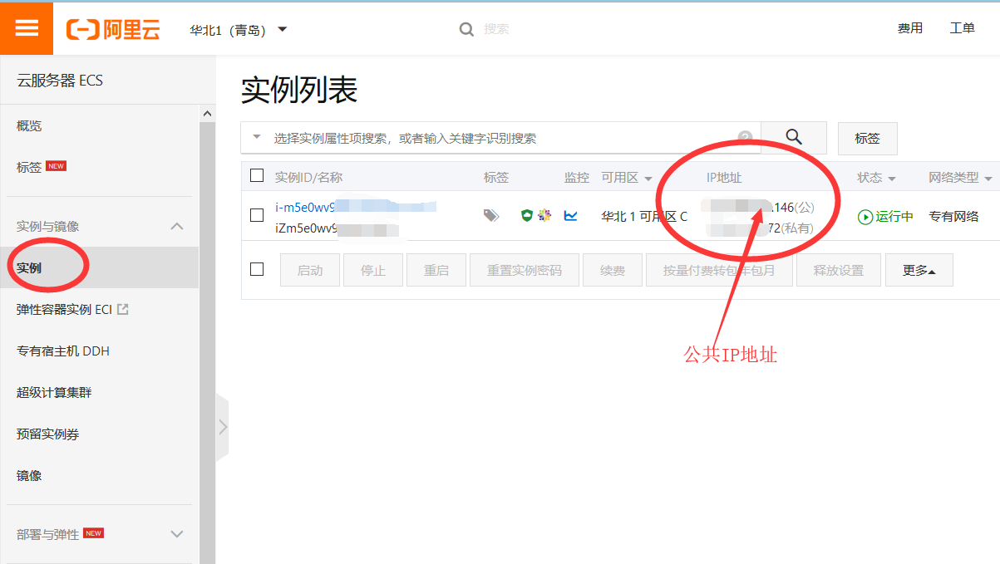
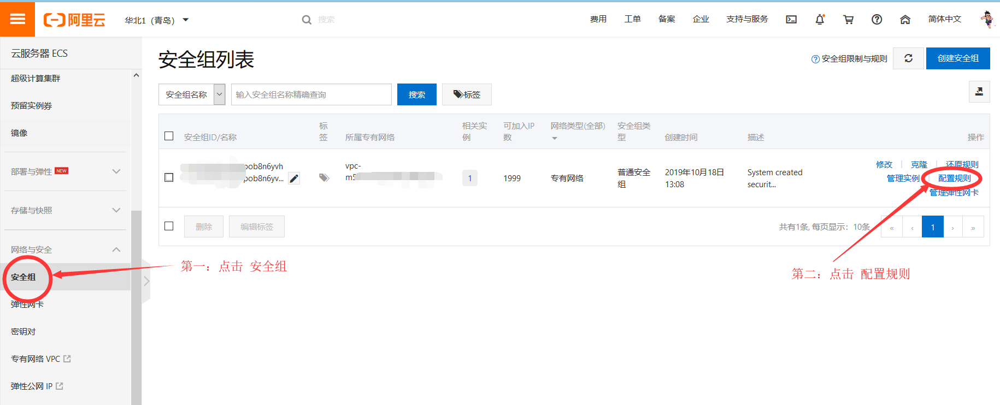
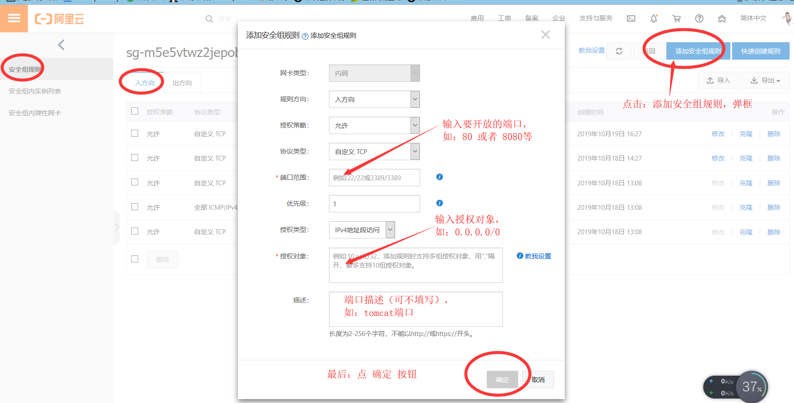

**前提：小白学习阿里云服务器，记录笔记。我的云服务器 操作系统是   CentOS  7.6 64位。**

# 1、云服务器ECS 安装开发环境
  + ### 1-1）下载安装包

    下载开发需要的基本环境：JDK8、Tomcat8、Mysql5。

    这里提供百度云下载：<br>
    链接：https://pan.baidu.com/s/1QhWxYOPp4CF0Vu7y_Dld6Q&shfl=sharepset <br>
    提取码：5q8i 

  + ### 1-2）将安装包放在云服务器上

    首先，用 xshell登录云服务器，并创建安装包存放目录
    ```
    mkdir /home/temp
    ```
    通过FileZilla或者xftp工具将安装包导入 该目录下。

 + ### 1-3）安装 JDK8

    进入 /home/temp 目录，将 jdk-8u11-linux-x64.tar.gz 解压并复制到 /usr/local 文件夹下。切换到 /usr/local 文件夹下，创建软连接 java 文件夹，便于以后更改 jdk 版本。

    ```
    [root@andy /]# cd /home/temp
    [root@andy temp]# ls
    apache-tomcat-8.5.43.tar.gz  jdk-8u11-linux-x64.tar.gz
    [root@andy temp]# tar zxf jdk-8u11-linux-x64.tar.gz -C /usr/local
    [root@andy temp]# cd /usr/local/
    [root@andy local]# ln -s jdk1.8.0_11/ java
    ```

    通过 vim 编辑 /etc/profile，设置 jdk 环境变量

    ```
    [root@andy local]# vim /etc/profile
    ```

    按“向下”箭头定位到文件最后一行，回车。按 "i" 键进行编辑，输入

    ```
    #set java environment
    export JAVA_HOME=/usr/local/java
    export JRE_HOME=$JAVA_HOME/jre
    export CLASSPATH=.:$JAVA_HOME/lib:$JRE_HOME/lib:$CLASSPATH
    export PATH=$JAVA_HOME/bin:$JRE_HOME/bin:$JAVA_HOME:$PATH
    ```

    回车，按 esc 键 退出编辑，回车后输入 ":wq!" 退出 vim。

    输入以下命令，使 profile 配置立即生效

    ```
    [root@andy local]# source /etc/profile
    ```

    安装完毕。输入命令 java -version，测试是否成功：

    ```
    [root@andy local]# java -version
    java version "1.8.0_11"
    Java(TM) SE Runtime Environment (build 1.8.0_11-b12)
    Java HotSpot(TM) 64-Bit Server VM (build 25.11-b03, mixed mode)
    ```

 + ### 1-4）安装 Tomcat8

    安装方法同上（安装JDK）。

    进入 /home/temp 目录，将 apache-tomcat-8.5.43.tar.gz 解压并复制到 /usr/local 文件夹下。

    切换到 /usr/local/apache-tomcat-8.5.43/bin 文件夹下，通过 vim 编辑setclasspath.sh，设置 JAVA_HOME。

    ```
    [root@andy local]# cd /home/temp
    [root@andy temp]# tar -zxf apache-tomcat-8.5.43.tar.gz -C /usr/local/
    [root@andy temp]# cd /usr/local
    [root@andy local]# ls
    aegis                 bin  games    java         lib    libexec  share
    apache-tomcat-8.5.43  etc  include  jdk1.8.0_11  lib64  sbin     src
    [root@andy local]# cd apache-tomcat-8.5.43/bin
    [root@andy bin]# vim setclasspath.sh
    ```

    按“向下”箭头定位到文件最后一行，回车。按 "i" 键进行编辑，输入

    ```
    # set jdk path
    export JAVA_HOME=/usr/local/java
    export JRE_HOME=/usr/local/java/jre
    ```

    回车，按 esc 键 退出编辑，回车后输入 ":wq!" 退出 vim。

    执行 startup.sh，启动 tomcat，查看日志是否成功：
    
    ```
    [root@andy bin]# ./startup.sh 
    Using CATALINA_BASE:   /usr/local/apache-tomcat-8.5.43
    Using CATALINA_HOME:   /usr/local/apache-tomcat-8.5.43
    Using CATALINA_TMPDIR: /usr/local/apache-tomcat-8.5.43/temp
    Using JRE_HOME:        /usr/local/java/jre
    Using CLASSPATH:       /usr/local/apache-tomcat-8.5.43/bin/bootstrap.jar:/usr/local/apache-tomcat-8.5.43/bin/tomcat-juli.jar
    Tomcat started.
    ```

    启动成功，浏览器输入云服务器实例分配的公网IP地址，加8080端口看能否有小猫猫出现。例如 http://118.190.204.146:8080/

    

    **注意：此时若访问不通，则可能是服务器实例，没有开通8080端口。看下边，配置云服务器安全组**

 + ### 1-5）配置云服务器安全组

    登录阿里云服务器ECS，打开控制台，按以下图片操作
    
    
    如需多个端口，可添加多条记录。

 + ### 1-6）安装 Mysql（未完待续......）

