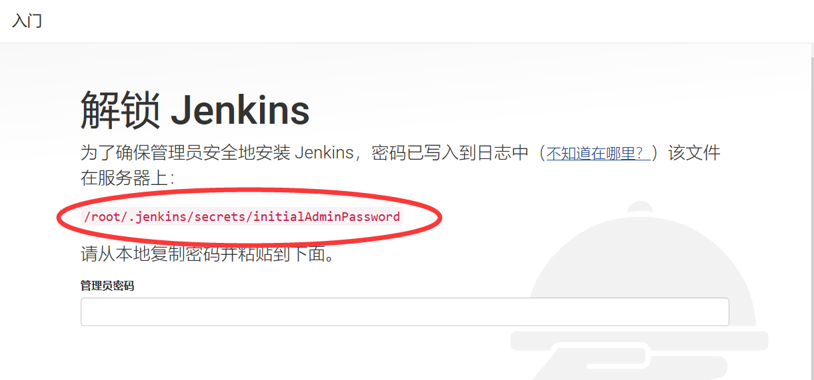
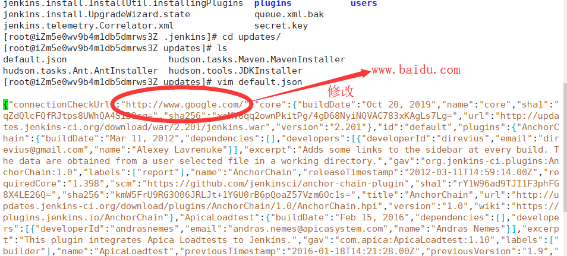
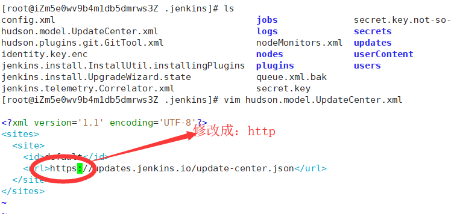
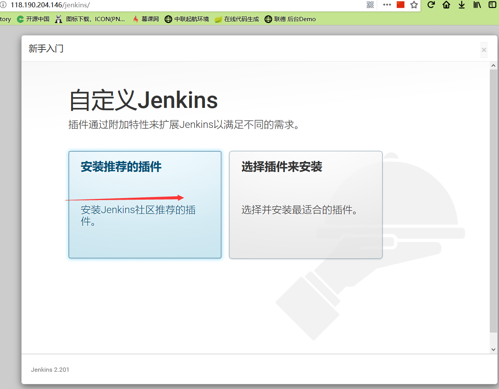
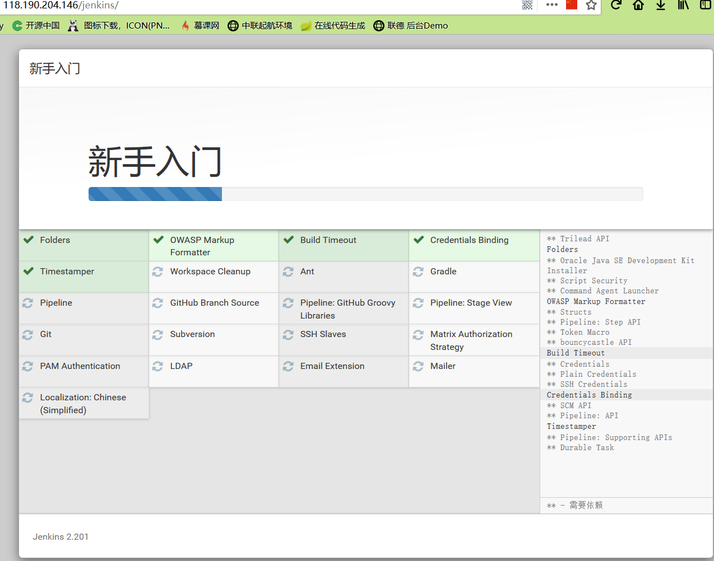
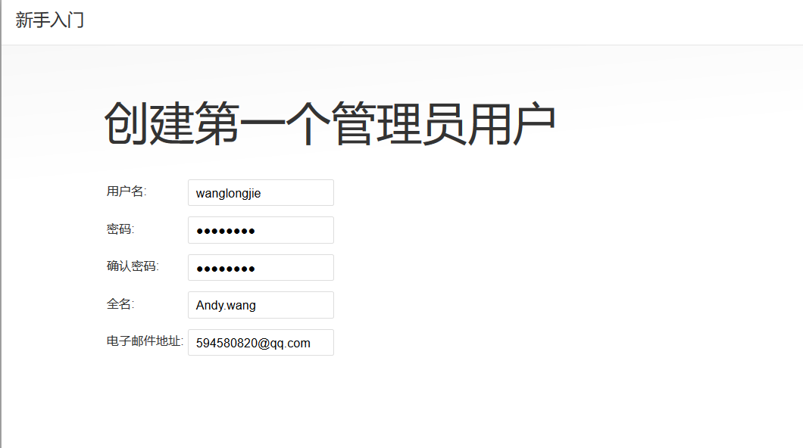

**前提：小白学习阿里云服务器，记录笔记。我的云服务器 操作系统是   CentOS  7.6 64位。**

# 1、云服务器ECS 安装开发环境
  ## 1-1）下载安装包，并将安装包放在云服务器上
  ### 1、下载开发需要的基本环境：JDK8、Tomcat8、Mysql5
  这里提供百度云下载：<br>
  链接：https://pan.baidu.com/s/1QhWxYOPp4CF0Vu7y_Dld6Q&shfl=sharepset <br>
  提取码：5q8i 

  ### 2、将安装包放在云服务器上
  首先，用 xshell登录云服务器，并创建安装包存放目录。
```powershell
[root@andy /]# mkdir /home/temp
```
  通过FileZilla或者xftp工具将安装包导入 该目录下。

 ## 1-2）安装 JDK8
 ### 1、创建 java 目录，并解压 tar 包
 切换到  /home/temp 目录，将 jdk-8u11-linux-x64.tar.gz 解压并复制到 		/usr/local 目录下。切换到 /usr/local 目录下，创建软连接 java 目录，便于以后更改 jdk 版本。

```powershell
[root@andy /]# cd /home/temp
[root@andy temp]# ls
apache-tomcat-8.5.43.tar.gz  jdk-8u11-linux-x64.tar.gz
[root@andy temp]# tar zxf jdk-8u11-linux-x64.tar.gz -C /usr/local
[root@andy temp]# cd /usr/local/
[root@andy local]# ln -s jdk1.8.0_11/ java
```
 ### 2、设置 jdk 环境变量
 通过 vim 编辑 /etc/profile，设置 jdk 环境变量

```powershell
[root@andy local]# vim /etc/profile
```

​按“向下”箭头定位到文件最后一行，回车。按 "i" 键进行编辑，输入

```powershell
#set java environment
export JAVA_HOME=/usr/local/java
export JRE_HOME=$JAVA_HOME/jre
export CLASSPATH=.:$JAVA_HOME/lib:$JRE_HOME/lib:$CLASSPATH

export PATH=$JAVA_HOME/bin:$JRE_HOME/bin:$JAVA_HOME:$PATH
```

 回车，按 esc 键 退出编辑，回车后输入 ":wq!" 退出 vim。

 输入以下命令，使 profile 配置立即生效

```powershell
[root@andy local]# source /etc/profile
```

 ### 3、安装完毕，测试
```powershell
[root@andy local]# java -version
java version "1.8.0_11"
Java(TM) SE Runtime Environment (build 1.8.0_11-b12)
Java HotSpot(TM) 64-Bit Server VM (build 25.11-b03, mixed mode)
```
 ## 1-3）安装 Tomcat-8.5.43
 ### 1、解压 tar 包到 /usr/local 目录
 进入 /home/temp 目录，将 apache-tomcat-8.5.43.tar.gz 解压并复制到 /usr/local 文件夹下。

```powershell
[root@andy local]# cd /home/temp
[root@andy temp]# tar -zxf apache-tomcat-8.5.43.tar.gz -C /usr/local/
```

 ### 2、设置 JAVA_HOME
 切换到 /usr/local/apache-tomcat-8.5.43/bin 文件夹下，通过 vim 编辑setclasspath.sh，设置 JAVA_HOME

```powershell
[root@andy temp]# cd /usr/local/apache-tomcat-8.5.43/bin
[root@andy bin]# vim setclasspath.sh
```
​按“向上”箭头定位到文件到第一行，按 "i" 键进行编辑，输入

```powershell
# set jdk path
export JAVA_HOME=/usr/local/java
export JRE_HOME=/usr/local/java/jre
```

​回车，按 esc 键 退出编辑，回车后输入 ":wq!" 退出 vim。

 ### 3、启动|关闭 tomcat，测试
​		执行 startup.sh，启动 tomcat，查看日志是否成功

```powershell
[root@andy bin]# ./startup.sh 
Using CATALINA_BASE:   /usr/local/apache-tomcat-8.5.43
Using CATALINA_HOME:   /usr/local/apache-tomcat-8.5.43
Using CATALINA_TMPDIR: /usr/local/apache-tomcat-8.5.43/temp
Using JRE_HOME:        /usr/local/java/jre
Using CLASSPATH:       /usr/local/apache-tomcat-8.5.43/bin/bootstrap.jar:/usr/local/apache-tomcat-8.5.43/bin/tomcat-juli.jar
Tomcat started.
```

​		启动成功，浏览器输入云服务器实例分配的公网IP地址，加8080端口看能否有tom猫出现。例如 http://119.192.205.186:8080/
​        

​		**注意：此时若访问不通，则可能是服务器实例，没有开通8080端口。看下边，[1-4）配置云服务器安全组](1-4）配置云服务器安全组)**

​		关闭 tomcat，则可以使用以下命令

```powershell
[root@andy bin]# ./shutdown.sh 
```

 ### 4、编写重启 tomcat 服务
 新建 restart.sh 文件（任意目录，我创建在 /usr/local/tomcat下），通过 vim 编辑

```powershell
[root@andy bin]# cd /usr/local
[root@andy local]# mkdir tomcat
[root@andy local]# cd tomcat/
[root@andy tomcat]# touch restart.sh
[root@andy tomcat]# vim restart.sh
```

 将以下内容复制到 restart.sh 中

```powershell
#!/bin/bash
    
#linux下tomcat重启（设置你的Tomcat路径）
tomcat_path=/usr/local/apache-tomcat-8.5.43
    
#关闭tomcat
${tomcat_path}/bin/shutdown.sh
    
#获取已经启动的pid
pid=`ps -ef | grep ${tomcat_path} | grep -v "grep" | awk '{print $2}'`
    
#判断pid是否为空，如果不为空，补偿措施，强制kill掉pid
        if [ -n "${pid}" ]; then
                #打印那些pid被kill掉了
                echo "kill tomcat: ${tomcat_path}; pid: ${pid}"
                kill -9 ${pid}
                #防止操作过快，未响应继续了后面的动作
                sleep 0.5
        fi
    
#删除缓存，如不需要可以注释掉
rm ${tomcat_path}/work/* -rf
    
#启动tomcat
${tomcat_path}/bin/startup.sh
    
#打印启动日志
tail -f ${tomcat_path}/logs/catalina.out
```

 添加执行权限（这里的u 这里指文件所有者，+x 添加可执行权限，*.sh表示所有的sh文件。），并执行
```powershell
[root@andy tomcat]# chmod u+x *.sh
[root@andy tomcat]# ./restart.sh
```

## 1-4）配置云服务器安全组
### 1、添加安全组
​登录阿里云服务器ECS，打开控制台，按以下图片操作（如需多个端口，可添加多条记录）

​
​

## 1-5）安装 Mysql-5.7.22
### 1、检查卸载 mariadb
​阿里云ECS默认安装了mariadb数据库，安装mysql前先卸载
```powershell
[root@andy ~]# rpm -qa|grep mariadb
mariadb-libs-5.5.60-1.el7_5.x86_64
[root@andy ~]# rpm -e --nodeps mariadb-libs-5.5.60-1.el7_5.x86_64
[root@andy ~]# rpm -qa|grep mariadb
```
### 2、解压安装 Mysql
+ 1）切换到 /home/temp 目录下，将 mysql-5.7.22-linux-glibc2.12-x86_64.tar.gz 解压并复制到 /usr/local。

  ```powershell
  [root@andy ~]# cd /home/temp/
  [root@andy temp]# tar -zxf mysql-5.7.22-linux-glibc2.12-x86_64.tar.gz -C /usr/local
  ```

+ 2）切换到 /usr/local，创建软连接文件夹 mysql。

  ```powershell
  [root@andy temp]# cd /usr/local/
  [root@andy local]# ln -s mysql-5.7.22-linux-glibc2.12-x86_64/ mysql
  ```

+ 3）添加系统 mysql组，添加mysql用户。

  ```powershell
  [root@andy local]# groupadd mysql
  [root@andy local]# useradd -r -g mysql mysql
  ```

+ 4）切换到 /mysql 目录，设置当前目录拥有者为mysql用户

  ```powershell
  [root@andy local]# cd mysql
  [root@andy mysql]# chown -R mysql:mysql ./
  ```

+ 5）安装 libaio、libaio-devel

  ```powershell
  [root@andy mysql]# yum install libaio*
    （回车，以下是日志）
    ......
    Transaction Summary
    ========================================================================================================
    Install  2 Packages
    
    Total download size: 37 k
    Installed size: 46 k
    Is this ok [y/d/N]: y
    （输入 Y）
    Downloading packages:
    (1/2): libaio-devel-0.3.109-13.el7.x86_64.rpm                                    |  13 kB  00:00:00     
    (2/2): libaio-0.3.109-13.el7.x86_64.rpm                                          |  24 kB  00:00:00     
    --------------------------------------------------------------------------------------------------------
    
    Complete!
    [root@andy mysql]# yum install -y libaio libaio-devel
    （回车，以下是日志）
    Loaded plugins: fastestmirror
    Loading mirror speeds from cached hostfile
    Package libaio-0.3.109-13.el7.x86_64 already installed and latest version
    Package libaio-devel-0.3.109-13.el7.x86_64 already installed and latest version
    Nothing to do
  ```

+ 6）安装 mysql 数据库（命令 bin/mysqld --initialize --user=mysql --basedir=/usr/local/mysql --datadir=/usr/local/mysql/data），记录临时密码（**重要，后边修改密码要用到**），我的临时密码是：/epdAbU7,3CK

  ```powershell
  [root@andy mysql]# bin/mysqld --initialize --user=mysql --basedir=/usr/local/mysql --datadir=/usr/local/mysql/data
    （回车，以下是日志）
    2019-10-19T13:50:03.897327Z 0 [Warning] TIMESTAMP with implicit DEFAULT value is deprecated. Please use --explicit_defaults_for_timestamp server option (see documentation for more details).
    2019-10-19T13:50:04.977013Z 0 [Warning] InnoDB: New log files created, LSN=45790
    2019-10-19T13:50:05.096715Z 0 [Warning] InnoDB: Creating foreign key constraint system tables.
    2019-10-19T13:50:05.202565Z 0 [Warning] No existing UUID has been found, so we assume that this is the first time that this server has been started. Generating a new UUID: 5aed0cdd-f277-11e9-91a5-00163e055571.
    2019-10-19T13:50:05.205240Z 0 [Warning] Gtid table is not ready to be used. Table 'mysql.gtid_executed' cannot be opened.
    2019-10-19T13:50:05.205731Z 1 [Note] A temporary password is generated for root@localhost: /epdAbU7,3CK
  ```

+ 7）创建 **RSA private key**，修改当前目录拥有者是mysql用户，修改当前 data目录拥有者是mysql用户

  ```powershell
  [root@andy mysql]# bin/mysql_ssl_rsa_setup --datadir=/usr/local/mysql/data
    （回车，以下是日志）
    Generating a 2048 bit RSA private key
    ...............+++
    .+++
    writing new private key to 'ca-key.pem'
    -----
    Generating a 2048 bit RSA private key
    .........................+++
    ...+++
    writing new private key to 'server-key.pem'
    -----
    Generating a 2048 bit RSA private key
    ............+++
    .................................+++
    writing new private key to 'client-key.pem'
    -----
  [root@andy mysql]# chown -R mysql:mysql ./
  [root@andy mysql]# chown -R mysql:mysql data
  ```

+ 8）配置my.cnf。通过 vim /etc/my.cnf 编辑，将以下内容复制进去即可（按 i 键开始编辑，粘贴后回车，按 esc 键退出编辑，输入 :wq! 回车退出vim）

  ```powershell
  [mysqld]
  character_set_server=utf8
  init_connect='SET NAMES utf8'
  basedir=/usr/local/mysql
  datadir=/usr/local/mysql/data
  socket=/tmp/mysql.sock #不区分大小写
  lower_case_table_names=1 #不开启sql严格模式
  sql_mode=STRICT_TRANS_TABLES,NO_ZERO_IN_DATE,NO_ZERO_DATE,ERROR_FOR_DIVISION_BY_ZERO,NO_AUTO_CREATE_USER,NO_ENGINE_SUBSTITUTION
  log-error=/var/log/mysqld.log
  pid-file=/usr/local/mysql/data/mysqld.pid
  
  [mysql]
  default-character-set=utf8
  ```

+ 9）添加开机启动，并 编辑 /etc/inti.d/mysqld，

  ```powershell
  [root@andy mysql]# cp /usr/local/mysql/support-files/mysql.server /etc/init.d/mysqld
  [root@andy mysql]# vim /etc/init.d/mysqld
  ```

  ​		通过上下箭头键找到 basedir、datadir 添加以下路径，效果图下图

  ```powershell
  basedir=/usr/local/mysql
  datadir=/usr/local/mysql/data
  ```

  ​
  
+ 10）启动mysql，加入开机启动

  ```powershell
  [root@andy mysql]# service mysqld start
    Starting MySQL. [  OK  ]
  [root@andy mysql]# chkconfig -add mysqld
  ```

+ 11）登录，并修改密码

  ```powershell
  [root@andy mysql]# mysql -uroot -p
    Enter password: （输入临时密码）
    Welcome to the MySQL monitor.  Commands end with ; or \g.
    Your MySQL connection id is 2
    Server version: 5.7.22
    ......
   （修改密码）
   mysql> alter user 'root'@'localhost' identified by 'root';
    Query OK, 0 rows affected (0.00 sec)
   （刷新权限）
   mysql> flush privileges;
    Query OK, 0 rows affected (0.00 sec)
   （添加用户：111111为用户密码，test为用户名）
   mysql> grant all privileges on *.* to 'test'@'%' identified by '111111' with grant option;
    Query OK, 0 rows affected, 1 warning (0.01 sec)
    
    mysql> exit
  ```

+ 12）mysql命令启动、关闭、重启

  ```powershell
  [root@andy ~]# service mysqld restart
  Shutting down MySQL..      [  OK  ]
  Starting MySQL.            [  OK  ]
  [root@andy ~]# service mysqld stop
  Shutting down MySQL..      [  OK  ]
  [root@andy ~]# service mysqld start
  Starting MySQL.            [  OK  ]
  ```

+ 13）安装完成，可以使用工具连接数据库了
### 3、配置云服务器安全组 开放3306端口
​配置云服务器安全组，添加3306端口（详情见 "[1-4）配置云服务器安全组](#1-4）配置云服务器安全组)"）

## 1-6）安装 redis-5.0.3
### 1、安装 gcc

​		以下命令逐一执行：

```powershell
[root@andy ~]yum install cpp  
[root@andy ~]yum install binutils
[root@andy ~]yum install glibc-kernheaders
[root@andy ~]yum install glibc-common
[root@andy ~]yum install glibc-devel
[root@andy ~]yum install gcc
[root@andy ~]yum install make
```

### 2、下载 redis，并安装

​		切换到 /home/temp 目录下，下载 tar包，并解压到 /use/local 目录。切换到 /usr/local/redis-5.0.3 目录下，执行 make 命令 安装。

```powershell
[root@andy ~]# cd /home/temp
[root@andy temp]wget http://download.redis.io/releases/redis-5.0.3.tar.gz
  （...下载过程）
[root@andy temp]# tar xzf redis-5.0.3.tar.gz -C /usr/local
[root@andy temp]# cd /usr/local/redis-5.0.3/
[root@andy redis-5.0.3]# make
  （...安装过程）
  make[1]: Leaving directory `/usr/local/redis-5.0.3/src'
```
​		创建 /usr/local/redis 目录

```powershell
[root@andy redis-5.0.3]# mkdir /usr/local/redis
```

​		将/usr/local/redis-5.0.3/src 目录下 redis-cli、redis-server 复制到 /usr/local/redis 目录下

```powershell
[root@andy src]# cd src
[root@andy src]# cp redis-cli redis-server /usr/local/redis
```

​		将 /usr/local/redis-5.0.3 目录下的 redis.conf 复制到 /usr/local/redis 目录下

```powershell
[root@andy src]# cd ..
[root@andy redis-5.0.3]# cp redis.conf /usr/local/redis
```

### 3、vim 编辑 redis.conf，配置参数

​		通过vim编辑 redis.conf ，将启动方式修改为后端启动，并设置redis密码。

```powershell
[root@andy redis-5.0.3]# cd /usr/lcoal/redis
[root@andy redis]# vim redis.conf
```

​        设置密码：

​
​		将启动方法修改为后端启动：

​
​		修改链接（需要慎重）：

​

### 4、启动|关闭 redis，并使用 redis-cli 连接测试

​		启动 redis

```powershell
[root@andy redis]# ./redis-server redis.conf
  5466:C 22 Oct 2019 17:17:37.170 # oO0OoO0OoO0Oo Redis is starting oO0OoO0OoO0Oo
  5466:C 22 Oct 2019 17:17:37.170 # Redis version=5.0.3, bits=64, commit=00000000, modified=0, pid=5466, just started
  5466:C 22 Oct 2019 17:17:37.170 # Configuration loaded
```

​		用 redis-cli 工具连接测试

```powershell
[root@andy redis]# ./redis-cli 
127.0.0.1:6379> auth 你设置的密码
OK
127.0.0.1:6379> set myName andy
OK
127.0.0.1:6379> get myName
"andy"
127.0.0.1:6379> 
```

​		关闭redis（redis-cli 登录成功后操作），可以使用

```powershell
127.0.0.1:6379> shutdown
```

### 5、配置云服务器安全组 开放6379端口
​		配置云服务器安全组，添加6379端口（详情见 "[1-4）配置云服务器安全组](#1-4）配置云服务器安全组)"）


  ## 1-7）安装 maven-3.6.2
  ### 1、下载 maven
  maven 官网下载地址：http://maven.apache.org/download.cgi 找到合适版本对应的 tar.gz 包，右键选择“复制连接地址”，使用 wget 下载

```powershell
[root@andy ~]# cd /home/temp
[root@andy temp]# wget http://mirrors.tuna.tsinghua.edu.cn/apache/maven/maven-3/3.6.2/binaries/apache-maven-3.6.2-bin.tar.gz
（以下是日志......）

2019-10-23 13:33:28 (52.7 MB/s) - ‘apache-maven-3.6.2-bin.tar.gz’ saved [9142315/9142315]
```

  ### 2、解压 tar 包

​		解压 tar 包到 /usr/local 目录下，并切换到该目录下，创建 软连接 maven

```powershell
[root@andy temp]# tar -zxvf apache-maven-3.6.2-bin.tar.gz -C /usr/local/
（以下是日志......）
apache-maven-3.6.2/lib/maven-slf4j-provider-3.6.2.jar
apache-maven-3.6.2/lib/jansi-1.17.1.jar

[root@andy temp]# cd /usr/local/

[root@andy local]# ln -s apache-maven-3.6.2/ maven
```

  ### 3、配置 maven 环境变量

​		vim 编辑 /etc/profile 文件，将 maven 环境变量添加到最下边，并重新设置Path（Java 环境变量在安装 jdk 时已添加）

```powershell
[root@andy local]# vim /etc/profile

#set java environment
export JAVA_HOME=/usr/local/java
export JRE_HOME=$JAVA_HOME/jre
export CLASSPATH=.:$JAVA_HOME/lib:$JRE_HOME/lib:$CLASSPATH
    
#set maven environment
export MAVEN_HOME=/usr/local/maven
    
export PATH=$JAVA_HOME/bin:$JRE_HOME/bin:$JAVA_HOME:$PATH:$MAVEN_HOME/bin
```

  ### 4、执行配置，并测试 maven 是否安装成功

```powershell
[root@andy apache-maven-3.6.2]# source /etc/profile

[root@andy apache-maven-3.6.2]# mvn -version
Apache Maven 3.6.2 (40f52333136460af0dc0d7232c0dc0bcf0d9e117; 2019-08-27T23:06:16+08:00)
Maven home: /usr/local/maven
Java version: 1.8.0_11, vendor: Oracle Corporation, runtime: /usr/local/jdk1.8.0_11/jre
Default locale: en_US, platform encoding: UTF-8
OS name: "linux", version: "3.10.0-957.21.3.el7.x86_64", arch: "amd64", family: "unix"
```

## 1-8）安装 Jenkins
  ### 1、下载 Jenkins
  打开jenkins官网：https://jenkins.io/download/ ，选择合适版本的 Generic Java package(.war)，右键选择“复制连接地址”，使用 wget 下载

```powershell
[root@andy ~]# cd /home/temp
[root@andy test]# wget http://mirrors.jenkins.io/war/latest/jenkins.war
(以下是日志......)
--2019-10-24 13:26:44--  http://mirrors.jenkins.io/war/latest/jenkins.war
Resolving mirrors.jenkins.io (mirrors.jenkins.io)... 52.202.51.185
Connecting to mirrors.jenkins.io 
......

```

  ### 2、安装 Jenkins

​		将 jenkins.war 复制到 tomcat webapps 目录下，重启tomcat

```powershell
[root@andy temp]# cp jenkins.war /usr/local/apache-tomcat-8.5.43/webapps/
[root@andy temp]# cd /usr/local/apache-tomcat-8.5.43/webapps/
[root@andy webapps]# ls
docs  examples  host-manager  jenkins  jenkins.war  manager  ROOT
[root@andy webapps]# rm jenkins.war 
rm: remove regular file ‘jenkins.war’? y
[root@andy webapps]# ls
docs  examples  host-manager  jenkins  manager  ROOT
```
​      浏览器访问 Jenkins 项目，http://119.192.205.186/jenkins（你的公网IP:端口/项目名） ，进入主页

​	​

### 3、修改配置

​		**进入主页后，先不急着按提示找到密码并下一步操作**，先修改以下配置项，不然很可能会遇到离线问题。

​		按提示，切换到 /roor/.jenkins 目前下

```powershell
[root@andy webapps]# cd /root/.jenkins
（查看目前下 内容）
[root@andy .jenkins]# ls
config.xml                                     jobs              secret.key.not-so-secret
hudson.model.UpdateCenter.xml                  logs              secrets
hudson.plugins.git.GitTool.xml                 nodeMonitors.xml  updates
identity.key.enc                               nodes             userContent
jenkins.install.InstallUtil.installingPlugins  plugins           users
jenkins.install.UpgradeWizard.state            queue.xml.bak
jenkins.telemetry.Correlator.xml               secret.key

(查看 updates 目录下 内容，并 vim 编辑 default.json 文件)
[root@andy .jenkins]# cd updates/
[root@andy updates]# ls
default.json                   hudson.tasks.Maven.MavenInstaller
hudson.tasks.Ant.AntInstaller  hudson.tools.JDKInstaller

（编辑 default.json ，如下图所示，将 www.google.com 修改成 www.baidu.com）
[root@andy updates]# vim default.json
 
 (回到上一级。编辑 hudson.model.UpdateCenter.xml，如下图所示，将 https 修改成 http)
[root@andy updates]# cd ..
[root@andy .jenkins]# vim hudson.model.UpdateCenter.xml 

```


​ 
​	重启 tomcat，安装 页面提示，找到 管理员密码，输入，点击“继续”

```powershell
[root@andy .jenkins]# tail /root/.jenkins/secrets/initialAdminPassword 
52df88db54a25ef68c32811b6590a0d0
```

​	选择“安装推荐的插件”，安装插件

 
 
​	插件安装后，跳入创建管理员用户界面。至此，Jenkins安装并初始化完成了



### 4、Jenkins使用文档

​	jenkins使用文档，参考：https://jenkins.io/zh/doc/pipeline/tour/getting-started/


## 欢迎交流
+ QQ
    
    
+ 微信

    


